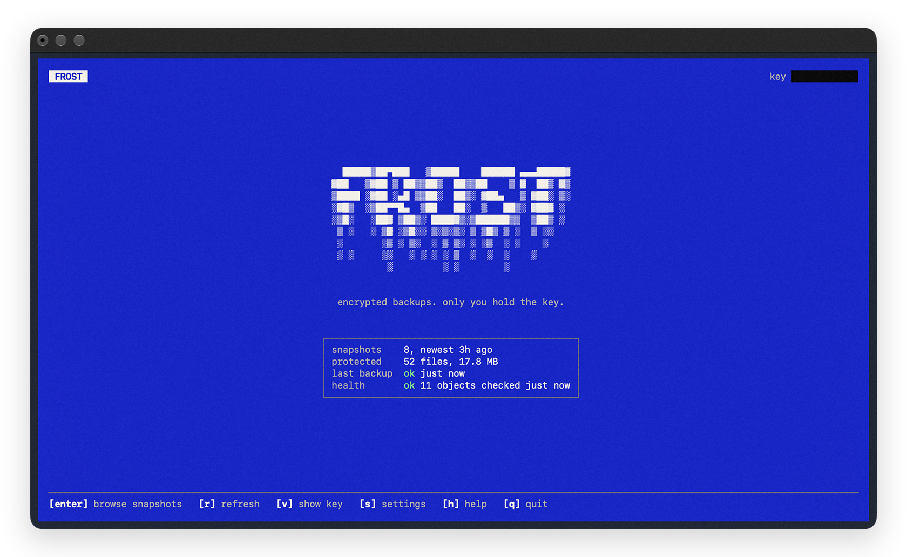

<div align="center">
   
</div>

<p align="center">Backup your files. Encrypted, incrementally to storage you choose.</p>

<p align="center">
  <a href="#install">Install</a> ·
  <a href="#quickstart">Quickstart</a> ·
  <a href="docs/CLI.md">Docs</a> ·
  <a href="docs/CHANGELOG.md">Changelog</a> ·
  <a href="#license">License</a>
</p>

<p align="center">
<a href="https://github.com/rhymeswithlimo/frost/releases"></a>
<a href="https://github.com/rhymeswithlimo/frost/actions/workflows/ci.yml"></a>
<a href="LICENSE"></a>


</p>

---

frost is a single binary that backs up your directories to an S3-compatible bucket or to [Permafrost](https://example.com), on a schedule. Backup data is encrypted on your machine before it's uploaded.

frost generates your encryption key locally and shows it as a 24 word recovery phrase. Storage providers may require an account and separate credentials.

- **Client-side encryption**: XChaCha20-Poly1305 with a key that never leaves your machine.
- **Only uploads what's changed**: content-defined chunking means an edit in the middle of a big file re-uploads a chunk or two, not the whole file.
- **Readable snapshots**: every run gets an ID like `maple-otter-3f1c`. Restore by ID or by time (`3 days ago`, `yesterday`, `2026-09-20`).
- **Terminal browser**: browse snapshots, diff them and pick files to restore in frost's very own TUI.
- **Checks itself**: after each backup, frost re-downloads a random sample of chunks and verifies them, so problems show up in `frost status` before you need a restore.
- **Runs on a schedule**: launchd, systemd, cron or Task Scheduler, set up for you during `frost init`.
- **Keeps itself up to date**: scheduled backups install new releases, checked against frost's signing key first. `frost update` does it now.

<div align="center">
   
</div>

## Install

```sh
curl -fsSL https://raw.githubusercontent.com/rhymeswithlimo/frost/main/install/install.sh | sh
```

Works on macOS, Linux and Windows (through Git Bash). The installer verifies the signed checksums, checks the archive's SHA-256 and installs the binary. If its directory isn't on your PATH, it prints instructions to add it.

If you prefer doing it by hand, grab an archive from [Releases](https://github.com/rhymeswithlimo/frost/releases), or:

```sh
go install github.com/rhymeswithlimo/frost/cmd/frost@latest
```

Builds from source don't update themselves. Run `go install` again for a new version.

## Quickstart

```sh
frost init                  # pick directories, schedule and storage; save your recovery phrase
frost backup --dry-run      # see exactly what would be uploaded
frost backup                # back up now
frost status                # recent snapshots, next run, health
frost restore "2 days ago" ~/Documents/report.pdf --beside
frost browse                # browse snapshots, diff them, pick files to restore
```

Every restore says where it goes: `--beside` (a new folder next to the originals), `--to <dir>` (a new folder inside `<dir>`) or `--overwrite` (back over the originals, asks first). Only `--overwrite` can replace existing files.

> [!IMPORTANT]
> Save your recovery phrase somewhere safe! It's the only way to decrypt your backups, and there's no way to reset it.

> [!NOTE]
> On macOS, folders like `~/Documents` and `~/Desktop` are privacy protected. If a backup fails with "operation not permitted", add the `frost` binary under System Settings > Privacy & Security > Full Disk Access.

## Commands

```text
frost <command> [flags]

COMMANDS:
   init                          interactive setup: directories, schedule, storage, key
   backup                        back up the configured directories now
   restore [snapshot] [paths]    restore a whole snapshot or chosen paths
   status                        recent snapshots, last and next run, verification health
   browse                        open the snapshot browser (TUI)
   config [get|set|edit]         print or change settings
   key <show|verify|import>      manage your recovery phrase
   update                        install the latest release

GLOBAL (every command):
   --config-dir string           use a different config directory
   -h, --help                    show help for a command

BACKUP:
   -n, --dry-run                 list what would upload; don't upload or save a snapshot
   --path string                 back up this directory instead (repeatable)
   --exclude string              also skip this pattern for this run (repeatable)
   --no-verify                   skip the post-backup spot check

RESTORE:
   --beside                      restore into a new folder next to the originals
   --to string                   restore into a new folder inside this directory
   --overwrite                   restore over the originals (asks first)
   -y, --yes                     don't ask before overwriting

STATUS:
   --verify                      run a fresh verification first
   -a, --all                     list every snapshot

CONFIG:
   --show-secrets                show credentials instead of masking them

UPDATE:
   --check                       only say whether there's a newer release
```

A snapshot can be `latest`, an ID or its prefix (`maple`), a relative time (`12h`, `2w`, `3 days ago`), `yesterday`, or a date (`2026-09-20 14:30`). You always get the newest snapshot at or before that point. With no arguments in a terminal, `restore` opens the browser.

Full reference, including every setting and environment variable: [docs/CLI.md](docs/CLI.md).

## Storage

| Backend | For | Setup |
|---|---|---|
| `permafrost` | Storage you connect to with a single access key | Access key. API: [docs/PERMAFROST.md](docs/PERMAFROST.md) |
| `s3` | Any S3-compatible bucket: AWS S3, Backblaze B2, Cloudflare R2, Wasabi, MinIO, Garage | Bucket and access key. `frost init` has presets for the big providers. |

You pick one during `frost init`. Credentials can also come from the environment (`FROST_S3_ACCESS_KEY_ID`, `FROST_PERMAFROST_TOKEN` and friends), and those are never written to `config.toml`.

## Documentation

- [CLI reference](docs/CLI.md)
- [Architecture](docs/ARCHITECTURE.md)
- [Security model](docs/SECURITY.md)
- [Permafrost API](docs/PERMAFROST.md)
- [Changelog](docs/CHANGELOG.md)

## Development

frost is one Go module with no cgo, so a plain Go toolchain is all you need.

```sh
go build ./cmd/frost          # build the binary
go test ./...                 # run the test suite
go vet ./...                  # static checks
go run ./internal/tui/demo    # try the TUI against fake data
```

The demo takes `-latency 400ms`, `-empty` and `-broken` to simulate slow, empty and failing repositories. See [docs/CONTRIBUTING.md](docs/CONTRIBUTING.md) before opening a pull request, and [docs/ARCHITECTURE.md](docs/ARCHITECTURE.md) for how the pieces fit together.

## License

BSD 3-Clause, see [LICENSE](LICENSE).
